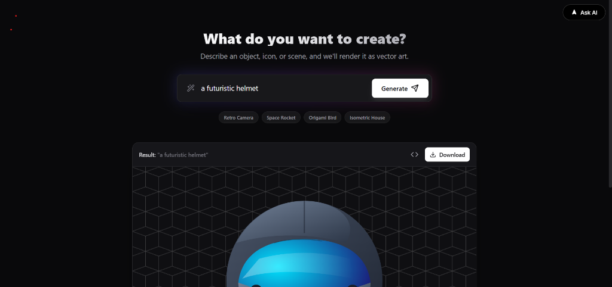

<div align="center">


# SVG Generator

### Transform your ideas into beautiful vector graphics with AI

[](https://svg-generator-blond.vercel.app/)
[](https://vercel.com/new/clone?repository-url=https://github.com/Zubair576335/svg-generator)
[](LICENSE)

[Live Demo](https://svg-generator-blond.vercel.app/) • [Report Bug](https://github.com/Zubair576335/svg-generator/issues) • [Request Feature](https://github.com/Zubair576335/svg-generator/issues)

</div>

---

## Overview

SVG Generator is a powerful, AI-driven tool that converts natural language descriptions into clean, scalable SVG code. Simply describe what you want to create, and watch as Google's Gemini AI generates production-ready vector graphics in seconds.

Perfect for designers, developers, and anyone who needs quick, customizable vector graphics without the learning curve of traditional design tools.



## Features

- **AI-Powered Generation** - Leverages Google Gemini AI for intelligent SVG creation
- **Real-time Preview** - Instant visual feedback as your SVG is generated
- **Editable Code** - View and modify the generated SVG code directly
- **One-Click Download** - Export your SVGs instantly
- **Versatile Outputs** - From simple icons to complex illustrations
- **Clean Interface** - Intuitive design focused on productivity
- **Web-Based** - No installation required, works in any modern browser

## Quick Start

### Try It Online

Visit [svg-generator-blond.vercel.app](https://svg-generator-blond.vercel.app/) to start creating SVGs immediately.

### Local Development

1. **Clone the repository**
   ```bash
   git clone https://github.com/Zubair576335/svg-generator.git
   cd svg-generator
   ```

2. **Install dependencies**
   ```bash
   npm install
   ```

3. **Set up environment variables**
   
   Create a `.env.local` file in the root directory:
   ```env
   GEMINI_API_KEY=your_google_gemini_api_key_here
   ```
   
   Get your API key from [Google AI Studio](https://makersuite.google.com/app/apikey)

4. **Start the development server**
   ```bash
   npm run dev
   ```

5. **Open your browser**
   
   Navigate to `http://localhost:3000`

## Tech Stack

- **Frontend Framework:** [React 19](https://react.dev/)
- **Build Tool:** [Vite](https://vitejs.dev/)
- **Language:** [TypeScript](https://www.typescriptlang.org/)
- **AI Model:** [Google Gemini](https://deepmind.google/technologies/gemini/)
- **Icons:** [Lucide React](https://lucide.dev/)
- **Deployment:** [Vercel](https://vercel.com/)

## Usage

1. Enter your description in the input field (e.g., "a futuristic helmet", "minimalist mountain logo")
2. Click Generate or press Enter
3. View the preview of your generated SVG
4. Download the SVG file or copy the code for use in your projects

### Example Prompts

- `"a minimalist sun icon with rays"`
- `"geometric mountain landscape"`
- `"abstract tech logo with circuits"`
- `"retro camera illustration"`
- `"isometric house icon"`

## Why SVG Generator?

| Traditional Methods | SVG Generator |
|-------------------|--------------|
| Requires design software | Just describe it |
| Hours of manual work | Seconds to generate |
| Steep learning curve | Natural language input |
| Static design files | Instantly editable code |
| License restrictions | You own the output |

## Contributing

Contributions are what make the open-source community such an amazing place to learn, inspire, and create. Any contributions you make are **greatly appreciated**.

1. Fork the Project
2. Create your Feature Branch (`git checkout -b feature/AmazingFeature`)
3. Commit your Changes (`git commit -m 'Add some AmazingFeature'`)
4. Push to the Branch (`git push origin feature/AmazingFeature`)
5. Open a Pull Request

## License

Distributed under the MIT License. See `LICENSE` for more information.

## Author

**Zubair Khan**

- GitHub: [@Zubair576335](https://github.com/Zubair576335)
- Email: khan576335@gmail.com

## Acknowledgments

- [Google Gemini](https://deepmind.google/technologies/gemini/) for the powerful AI model
- [Vercel](https://vercel.com/) for seamless deployment
- [Lucide](https://lucide.dev/) for beautiful icons
- The open-source community for inspiration

---

<div align="center">

**[⬆ back to top](#svg-generator)**

Made with ❤️ by [Zubair Khan](https://github.com/Zubair576335)

</div>
